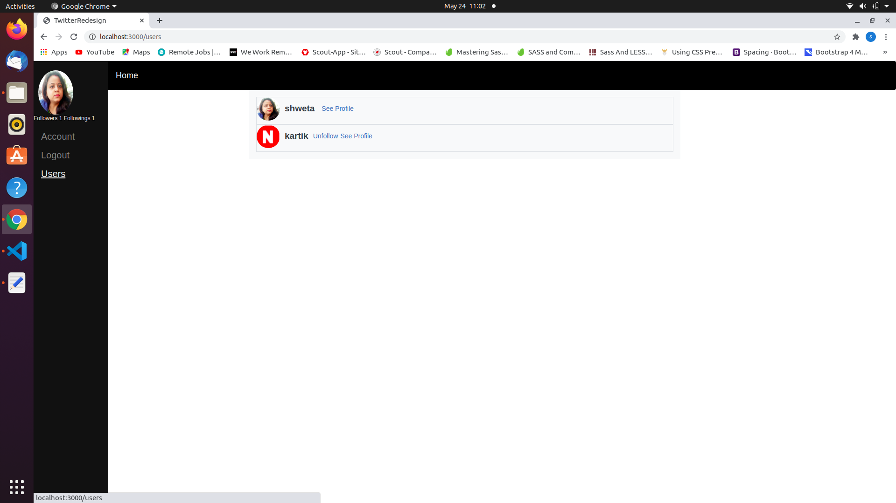

# Twitter Redesign





This project implements some feature of twitter and have three models in it user, following and tweets
As a guest user:
1. able to create account/log in.
2. can see only “Sign in” and “Sign out” page.

As a logged-in user:

1. able to see all users list.
2. able to see selected user page with their user name and all tweets written by them (the most recent tweets on the top).
3. able to follow other users.
4. can see a states for the followers and followings
5. able to create new tweets (text only).
6. able to see “Timeline” page with tweets (with number of likes and comments) written by me and all my friends (the most recent tweets on the top).
7. Timeline page should be the root page of the app.

## Built With

- Ruby v2.7.1
- Ruby on Rails v6.1.3

## Live Demo

https://calm-fortress-48296.herokuapp.com/


## Getting Started

To get a local copy up and running follow these simple example steps.

### Prerequisites

Ruby: 2.6.3
Rails: 5.2.3
Postgres: >=9.5
imagemagic

### Setup

Instal gems with:

```
bundle install --path vendor/bundle
```

Setup database with:

```
   rails db:create
   rails db:migrate
```

### Github Actions

To make sure the linters' checks using Github Actions work properly, you should follow the next steps:

1. On your recently forked repo, enable the GitHub Actions in the Actions tab.
2. Create the `feature/branch` and push.
3. Start working on your milestone as usual.
4. Open a PR from the `feature/branch` when your work is done.


### Usage

Start server with:

```
    rails server
```

Open `http://localhost:3000/` in your browser.

### Run tests

```
    rpsec --format documentation
```

## Authors

👤 **Author**

- GitHub: [@ShwetaSrivastava](https://github.com/vidhishweta01)
- Twitter: [@ShwetaSrivastava](https://twitter.com/vidhishweta01)
- LinkedIn: [ShwetaSrivastava](https://www.linkedin.com/in/vidhishweta01/)

## 🤝 Contributing

Contributions, issues, and feature requests are welcome!

Feel free to check the [issues page](issues/).

## Show your support

Give a ⭐️ if you like this project!

## Acknowledgments

- Hat tip to anyone whose code was used
- Inspiration
- etc

## 📝 License

This project is [MIT](LICENSE) licensed.

